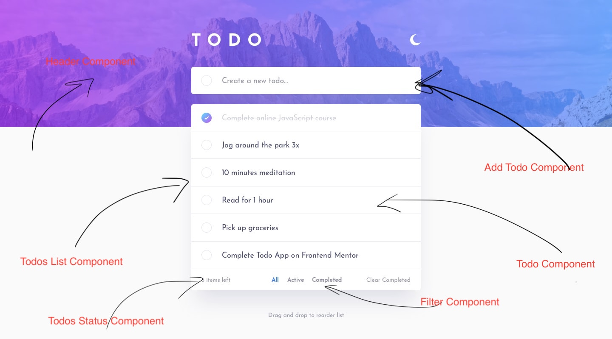

# Todo App UI Design

This is a solution to the [Todo app challenge on Frontend Mentor](https://www.frontendmentor.io/challenges/todo-app-Su1_KokOW). Frontend Mentor challenges help you improve your coding skills by building realistic projects. 

## Table of contents

- [Overview](#overview)
  - [The challenge](#the-challenge)
  - [Screenshot](#screenshot)
  - [Links](#links)
- [My process](#my-process)
  - [Built with](#built-with)
  - [Continued development](#continued-development)
- [Author](#author)

## Overview

### The challenge

Users should be able to:

- View the optimal layout for the app depending on their device's screen size
- See hover states for all interactive elements on the page
- Add new todos to the list
- Mark todos as complete
- Delete todos from the list
- Filter by all/active/complete todos
- Clear all completed todos
- Toggle light and dark mode
- **Bonus**: Drag and drop to reorder items on the list

### Screenshot

### Links

- [Live Site URL](https://shayan-todo.netlify.app/)

## My process

### Built with

- Semantic HTML5 markup
- CSS custom properties
- Flexbox
- Mobile-first workflow
- [React](https://reactjs.org/) - JS library
- [Styled Components](https://styled-components.com/) - For styles

### Continued development

This is a UI design for the next React Project. I used the Fronend Mentor Design for the prototype access only. All other modifications and functionlities by React has been added for development purposes

## Author

- Website - [Shayan Faghihi](https://shayan-faghihi.ir)
- Frontend Mentor - [@SHayanFaghihi](https://www.frontendmentor.io/profile/ShayanFaghihi)
- LinkedIn - [@shayanfaghihi](https://www.linkedin.com/in/shayanfaghihi/)
